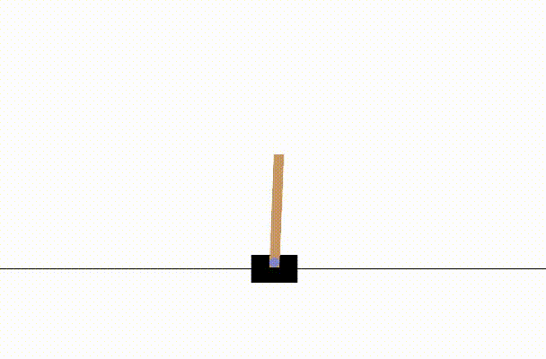

# Advantage-Actor-Critic-A2C-Algorithm-for-CartPole-Artificial-Intelligence-course
This project demonstrates the implementation of the Advantage Actor-Critic (A2C) algorithm to solve the CartPole environment from OpenAI's Gym library. A2C is a reinforcement learning (RL) technique that uses two neural networks—an actor and a critic—to learn optimal policies and value functions for decision-making tasks.

The goal of the CartPole task is to balance a pole on a moving cart by applying forces to the cart. The agent is trained to maximize cumulative rewards by keeping the pole upright as long as possible.

## Code Structure

- **Actor Network**: Outputs action probabilities based on the current state.
- **Critic Network**: Estimates the value of the current state.
- **Training Loop**:
  - Collects trajectories of states, actions, and rewards.
  - Computes advantages to optimize the actor and critic networks.
- **Evaluation**: Demonstrates the effectiveness of the trained policy on test episodes.

## Results

Here are two GIFs illustrating the difference between an agent acting randomly and a trained agent:

### **Random Agent**
The agent acts randomly without any learned policy, resulting in the pole falling quickly:

### **Trained Agent**
The trained A2C agent successfully balances the pole for extended periods:

